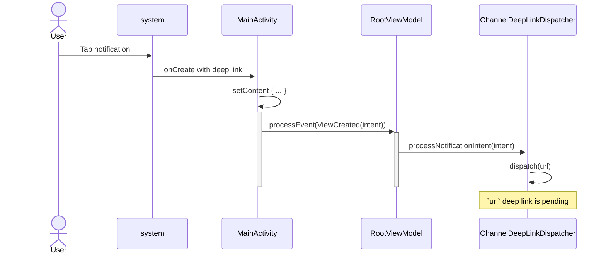
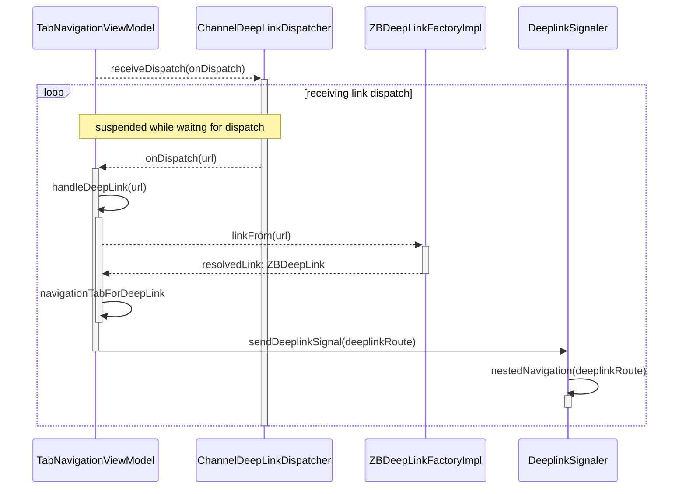
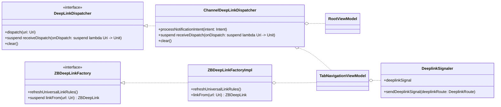
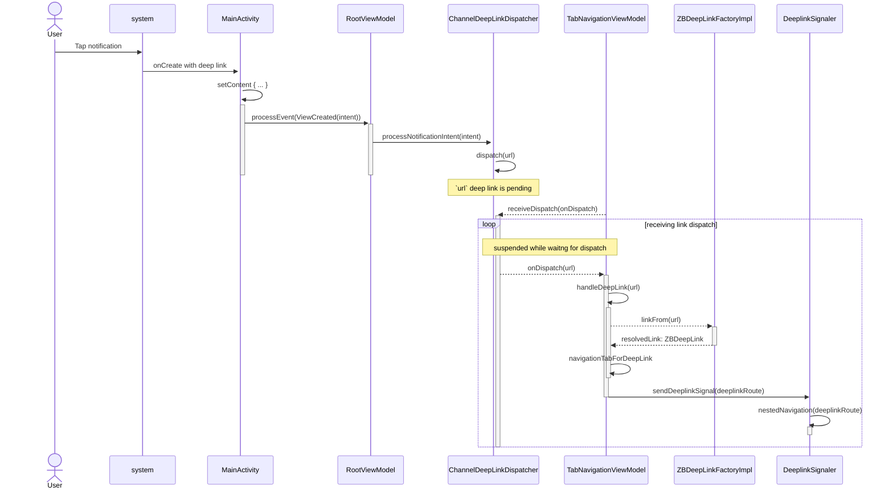

# Deep Links

## ZBDeepLink

`ZBDeepLink` is a sealed marker interface that is implemented for all of our supported deep link destinations.

For example, a concrete implementation for a deep link to the document viewer may look like this:

```kotlin
sealed interface ZBDeepLink

data class ZBDocumentDeepLink(
    val businessEntityUuid: UUID,
    val documentUuid: UUID
) : ZBDeepLink
```

## Resolving URLs to ZBDeepLink

### Resolution Rules

`native-app-service` defines a set of rules that client apps should use to resolve a URL's path to a well-known deep link.  A rule definition contains a regular expression pattern that we will check URL paths against, and an enum value for the rule's associated destination.

As part of post-login initialization, `ZBDeepLinkFactory` will load the universal link rules and cache them (in memory) to be used later.

!!! info "Links"
    - [Universal link rules schema definition on `native-app-service`](https://github.com/zenbusiness/native-app-service/blob/main/server/api/graphql/universalLink.graphql)
    - [Universal link rules query resolver on `native-app-service`](https://github.com/zenbusiness/native-app-service/blob/main/server/api/graphql/resolvers/universalLink.js) (includes rule definitions)

### ZBDeepLinkFactory

`ZBDeepLinkFactory` is our single entrypoint into resolving a URL to a `ZBDeepLink`.

The suspending `linkFrom(url: Uri)` function will check `url`'s path against the resolver rules.  If a match is found, deep link arguments will be extracted from the URL path and a `ZBDeepLink` will be returned.  If a match is not found, an instance of `ZBUnsupportedLink` will be returned with the URL.

!!! warning
    An attempt to resolve a URL with an unsupported `host` (e.g not `*.zenbusiness.com`) will cause `linkFrom` to throw a `ZenException` with `error = AppError.INVALID_DEEP_LINK_HOST`.

## Dispatching deep link URLs

### Processing push notifications



When a push notification is received, `AndroidAppNotificationManager` takes care to configure the notification's content intent to launch `MainActivity` with the expected deep link data when tapped.  When `MainActivity` receives the intent (`getIntent` in `onCreate`, or `onNewIntent` if the activity is already created) it is passed through `RootViewModel` to `DeepLinkDispatcher.processNotificationIntent`.

`DeepLinkDispatcher` will then extract the deep link data from the intent, validates the data, and dispatches the URL to a deep link receiver (see next section).

### Receiving dispatches



To receive deep links, call `DeepLinkDispatcher.receiveDispatch(onDispatch: suspend (Uri) -> Unit)` from a coroutine.  `onDispatch` will be invoked by the dispatcher for each deep link, and will suspend suspend while waiting for a deep link.

In the diagram above, `TabNavigationViewModel` receives the deep link dispatch, resolves the url to a `ZBDeepLink` using its injected `ZBDeepLinkFactory`, and then emits a tab navigation view effect and also sends a signal to the `DeeplinkSignaler` that will make a nested navigation inside the Tabs if needed to complete the deep link routing.

## Architecture

### Class diagram



### Intent processing sequence

The diagram below details the end-to-end happy-path sequence from app notification tap to deep link routing.


<script type="module">
      Array.from(document.getElementsByClassName("language-mermaid")).forEach(element => {
        element.classList.add("mermaid");
      });
      import mermaid from 'https://cdn.jsdelivr.net/npm/mermaid@11/dist/mermaid.esm.min.mjs';
      mermaid.initialize({ startOnLoad: true, theme: "dark" });
    </script>
